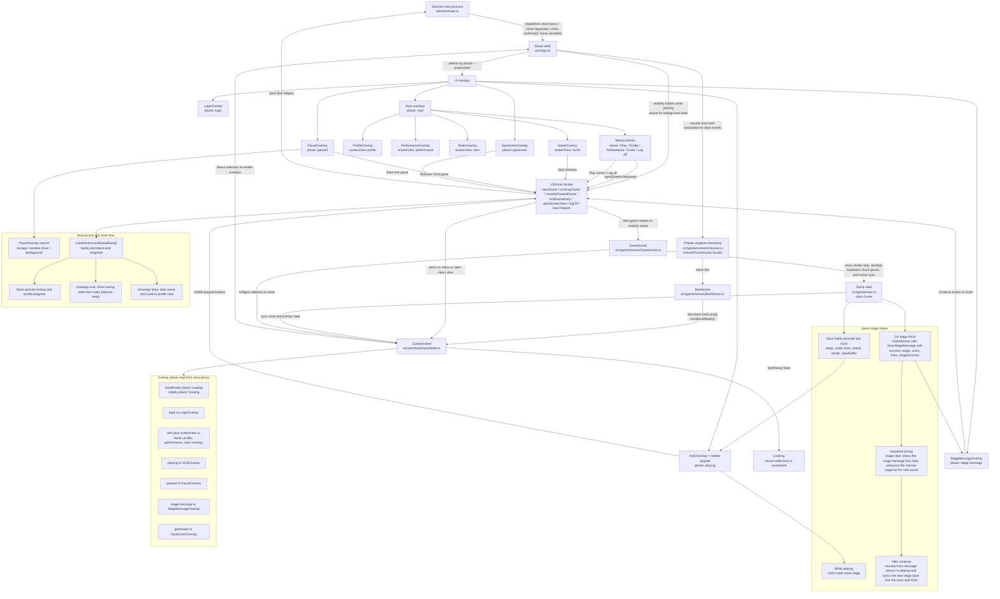

# UI Overlay and Game Engine Wiring

This diagram shows how the React overlays, Zustand store, Phaser scenes, core game logic, and Electron shell are currently wired together.

## Important details

- Zustand is the integration boundary. React does not talk directly to the Game class; React mostly reads store state and invokes UIScene facade functions.
- Phaser is created as a singleton in UIScene. App mounts the Phaser container, subscribes to Electron close events, and pauses active gameplay when the document becomes hidden, but scene lifecycle stays controlled from UIScene.
- Loading is driven by `bootReady`, not just `phase`. The initial store phase is `booting`, and `BootScene` waits for `document.fonts.ready` before `markBootReady()` sends the app either to `login` or directly to `start` when a remembered profile is still valid.
- The start menu is split across `phase` and `screenView`. `phase === 'start'` enables the menu family, `screenView` picks which start overlay is visible, and `MenuControls` owns the Home, Play Game, Profile, Performance, Rules, and Log off actions.
- HUD is not read-only. The mobile keypad in `HUDOverlay` calls UIScene input helpers, while `GameScene` still owns desktop keyboard input, touch-to-pause behavior, and Phaser render/update work.
- GameScene is the bridge layer. It forwards gameplay callbacks from `Game` into store updates such as `syncHUD`, `showStageMessage`, `showPauseOverlay`, and `showGameOver`.
- Stage status has two representations on purpose. The store `stage` field feeds the HUD during active play, while `stageMessage.stage` preserves the stage that was just cleared or lost for the stage-message overlay.
- On successful stage completion, the stage-message overlay is shown before the internal game stage increments for the next round. The next stage number reaches the HUD only after the player continues.
- A streak reward uses a temporary overlay-like message inside HUD state, not a separate `phase`. Gameplay pauses briefly, the store holds `streakRewardMessage`, and the scene auto-resumes after the timer.
- Pause reasons are explicit in store state: `escape`, `window-close`, and `background`. Both Electron close requests and browser visibility changes route through the same pause overlay machinery.
- Manual end and Electron close both use the same premature-end path. `GameScene.endGameEarly()` builds a gameplay snapshot, persists history/profile progress through the store, then either notifies Electron that close can proceed or routes the player back to the profile start view.
