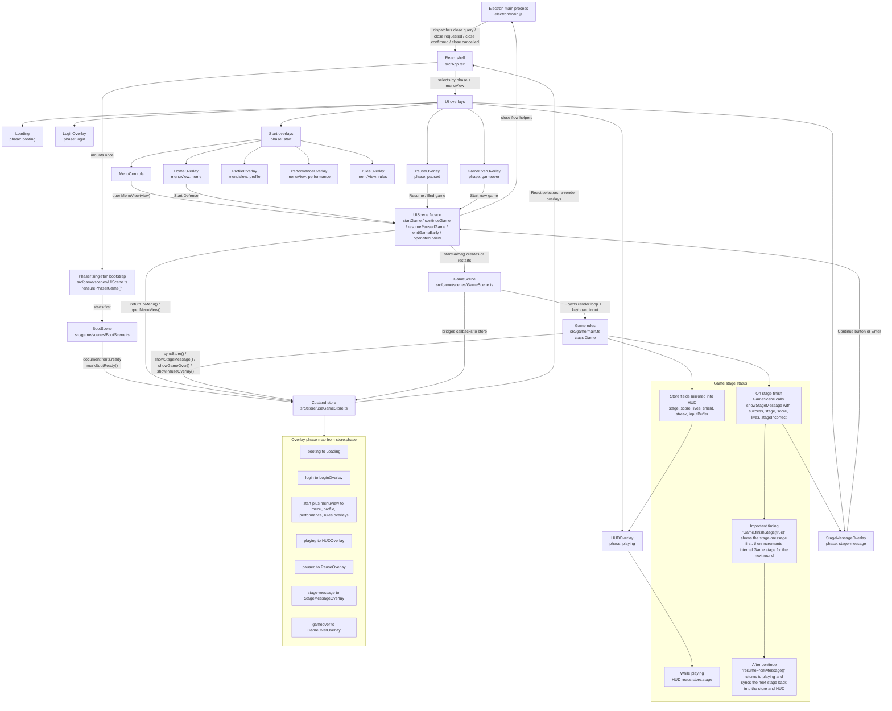

# UI Overlay and Game Engine Wiring

This diagram shows how the React overlays, Zustand store, Phaser scenes, core game logic, and Electron shell are wired together.

## Important details

- Zustand is the integration boundary. React does not talk directly to the Game class; React mostly reads store state and invokes UIScene facade functions.
- Phaser is created as a singleton in UIScene. App mounts the Phaser container, but scene lifecycle is controlled from UIScene.
- Boot is gated by web font readiness. BootScene waits for `document.fonts.ready` before moving the UI from `booting` to `login`.
- The start menu is split across `phase` and `menuView`. `phase === 'start'` enables the menu family, and `menuView` picks which start overlay is visible.
- GameScene is the bridge layer. It owns Phaser input/rendering and forwards gameplay callbacks from `Game` into store updates such as `syncHUD`, `showStageMessage`, `showPauseOverlay`, and `showGameOver`.
- Stage status has two representations on purpose. The store `stage` field feeds the HUD during active play, while `stageMessage.stage` preserves the stage that was just cleared or lost for the stage-message overlay.
- On successful stage completion, the stage-message overlay is shown before the internal game stage increments for the next round. The next stage number reaches the HUD only after the player continues.
- A streak reward uses a temporary overlay-like message inside HUD state, not a separate `phase`. Gameplay pauses briefly, the store holds `streakRewardMessage`, and the scene auto-resumes after the timer.
- Electron close handling is negotiated across processes. The main process asks the renderer whether a confirmation is needed, React forwards the events to UIScene, and UIScene either resumes play or ends the game early before allowing the window to close.
