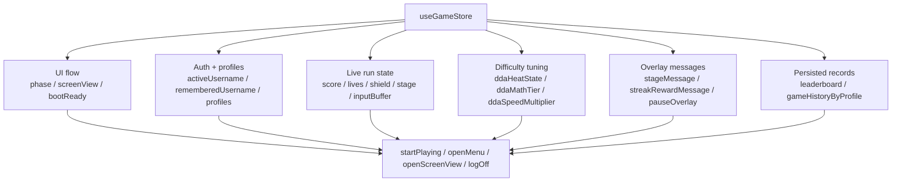

# Application store

## Store architecture

The game state is centralized in `src/store/useGameStore.ts` using Zustand. The store owns the UI flow, profile/session state, active run stats, DDA tuning, overlays, and persisted leaderboard/history data.

### Store structure diagram

### Main state items

| Key | Type | Description |
| --- | --- | --- |
| `phase` | `OverlayPhase` | Current overlay lifecycle: booting, login, start, playing, paused, stage-message, gameover. |
| `screenView` | `ScreenView` | Active React screen: home, profile, performance, or rules. |
| `bootReady` | `boolean` | Set once the boot sequence finishes and the app can render the main menu flow. |
| `activeUsername` | `string \| null` | Logged-in profile currently active for the session. |
| `rememberedUsername` | `string \| null` | Persisted username used to restore a session after reload. |
| `profiles` | `Record<string, PlayerProfile>` | Registered player profiles, including password, best score, highest reached stage, and timestamps. |
| `grade` | `Grade` | Current player grade, used for progression and leaderboard filtering. |
| `score` | `number` | Current in-run score. |
| `lives` | `number` | Remaining player lives. |
| `shield` | `number` | Shield strength for the base. |
| `stage` | `number` | Active stage number. |
| `stageScore` | `number` | Score accumulated during the current stage. |
| `inputBuffer` | `string` | Current typed answer buffer. |
| `correctCount` | `number` | Number of correct answers in the running session. |
| `incorrectCount` | `number` | Number of incorrect answers in the running session. |
| `streak` | `number` | Current answer streak. |
| `finalPerfScore` | `number` | Performance score used at game-over and leaderboard submission. |
| `ddaHeatState` | `DDAHeatState` | Dynamic difficulty state such as balanced, hot, or cooloff-related values. |
| `ddaMathTier` | `DDAMathTier` | Current math complexity tier in the DDA system. |
| `ddaSpeedMultiplier` | `number` | Current meteor speed multiplier derived from performance. |
| `ddaIsCooloffActive` | `boolean` | Whether the game is currently in a cooler recovery phase. |
| `stageMessage` | `StageMessageState \| null` | Stage transition message and summary metrics. |
| `streakRewardMessage` | `StreakRewardMessageState \| null` | Reward text shown after successful streak milestones. |
| `pauseOverlay` | `PauseOverlayState \| null` | Pause state triggered by escape/break or window close handling. |
| `leaderboard` | `Record<Grade, ScoreEntry[]>` | Highest-sorted leaderboard entries by grade. |
| `gameHistoryByProfile` | `Record<string, GameHistoryEntry[]>` | Per-profile session history used for lifetime grade and profile analytics. |

### Store actions and helper methods

| Action | Purpose |
| --- | --- |
| `markBootReady` | Restores a remembered profile or falls back to the login screen after startup. |
| `setGrade` | Updates the current grade without altering the rest of the run state. |
| `syncHUD` | Updates transient HUD values efficiently without writing to profile data. |
| `showStageMessage` | Triggers a stage summary overlay. |
| `showStreakRewardMessage` | Displays the streak bonus message. |
| `clearStreakRewardMessage` | Clears the active streak reward overlay. |
| `showPauseOverlay` | Shows a pause overlay for one of the supported reasons. |
| `hidePauseOverlay` | Restores the previous phase after unpausing. |
| `showSavingBeforeClose` | Shows a save-before-close state for shutdown flows. |
| `showGameOver` | Finalizes a run, updates best/highest profile metrics, and transitions to gameover. |
| `persistPrematureGameEnd` | Saves partial game history when the game exits unexpectedly. |
| `startPlaying` | Begins active gameplay and clears overlay state. |
| `openMenu` | Returns to the menu while preserving session data. |
| `openScreenView` | Opens a specific screen while keeping the game session intact. |
| `logOff` | Logs the current user out and returns to login. |
| `loginProfile` | Authenticates a known player profile. |
| `createAndLoginProfile` | Validates and creates a new player profile, then logs them in. |
| `getActiveProfile` | Resolves the profile object for the current user. |
| `saveScore` | Adds a leaderboard entry for a given grade. |
| `getScores` | Reads leaderboard entries, optionally filtered by grade. |
| `addGameHistory` | Appends a new gameplay record for the active profile or guest bucket. |
| `getGameHistory` | Retrieves recent game history for a profile or the active player. |

### Persistence rules

The Zustand persist middleware stores only the durable data needed across sessions:

- `leaderboard`
- `profiles`
- `gameHistoryByProfile`
- `rememberedUsername`

The live run state such as score, stage, lives, shield, input buffer, and overlay messages is intentionally not persisted. This keeps reloads predictable while preserving profile history and leaderboard continuity.

### Additional info useful to Copilot

- Keep gameplay logic in `src/game/main.ts` and Phaser rendering in `src/game/scenes/GameScene.ts`; avoid duplicating run-state behavior in the store.
- Treat Zustand as the integration boundary between React UI and Phaser gameplay state.
- When adding new persisted state, update both the `initialState` object and the `partialize` block in `useGameStore.ts` so the storage contract stays consistent.
- Use `syncHUD` for ephemeral UI updates that should not mutate persistent profile data or localStorage.
- `resolveLifetimeGrade` and `resolveActiveProfile` are the go-to helpers when profile-based grade or session state needs to be derived.
- Prefer editing the owning layer instead of scattering logic across overlay, Phaser, and React components.
- The `gameHistoryByProfile` data is profile-scoped, with guest sessions falling back to `__guest__`.
- `leaderboard` is grouped by grade; each entry contains name, score, perfScore, combined total, grade, and timestamp.

### Suggested Copilot prompts

- "Show how the store transitions from login to playing and then to gameover."
- "Where should I add a new gameplay stat so it stays in sync with the Phaser scene and React HUD?"
- "Explain which store fields are persisted and which are ephemeral."
- "Help trace a profile-grade update from `addGameHistory` through `resolveLifetimeGrade` to `showGameOver`."
- "Review the store for any state that should be added to `initialState` if I add a new gameplay mechanic."
